# Primera Práctica Calificada 
Integrantes:  
- Acuña Napan Jaime Gonzalo
- Zuñiga Chicaña, Alejandra Aztirma  

# Creacion de aplicaciones SaaS

**Objetivo:**  
El objetivo de este trabajo es comprender y documentar los pasos esenciales para crear, versionar e implementar una aplicación de Software como Servicio (SaaS). Además, se abordará la importancia de mantener la consistencia en los entornos de producción y desarrollo, asegurando que las bibliotecas y dependencias se gestionen adecuadamente.

**Tareas a Realizar:**  
En este proyecto, se llevarán a cabo las siguientes tareas:  
- Creación de una Aplicación "Hello World": Se desarrollará una aplicación de ejemplo utilizando el framework Sinatra.
- Versionamiento Correcto: Se aplicarán prácticas de versionamiento adecuadas para garantizar un control.efectivo del código fuente de la aplicación. Esto incluye el uso de sistemas de control de versiones como Git.

- Implementación en Heroku: La aplicación desarrollada se implementará en la plataforma de alojamiento en la nube Heroku. 


## Creación y versionado de una aplicación SaaS sencilla

Para llevar a cabo esto realizamos los siguientes pasos:

- Creamos un nuevo directorio vacío destinado a alojar nuestra nueva aplicación y utilizamos el comando git init en ese directorio para iniciar el control de versiones mediante Git.

- Dentro de este directorio, creamos un archivo nuevo llamado Gemfile con el siguiente contenido: 

 ```ruby
 source 'https://rubygems.org'
 ruby '2.6.6'  
 gem 'sinatra','>= 2.0.1'
 ```
             
Este archivo reconocera las versiones de las gemas (bibliotecas) que utilizaremos en nuestra aplicacion.

Luego, procedemos a la instalación de estas gemas ejecutando el comando `bundle install`. Esta acción instala automáticamente las gemas necesarias para el funcionamiento de nuestra aplicación.

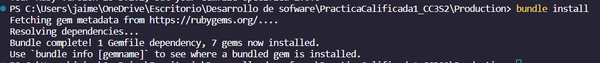

Para mantener un sistema de control de versiones para nuestra aplicación, utilizamos Git. Gracias a la configuración previa del Gemfile, podemos controlar las versiones de manera efectiva a través de Git.

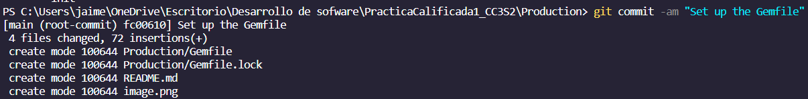

 

### Preguntas 
<details><summary>Respuestas</summary>
<p><blockquote>

**¿Cuál es la diferencia entre el propósito y el contenido de Gemfile y Gemfile.lock?**

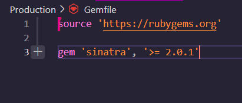

El archivo *Gemfile* que creamos alberga una lista de todas las 

Por otro lado, *Gemfile.lock* registra no solo las versiones de estas gemas, sino también las versiones de otras dependencias requeridas por las gemas especificadas en Gemfile.

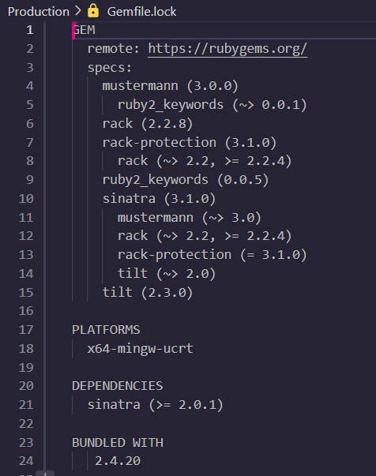

**¿Qué archivo se necesita para reproducir completamente las gemas del entorno de desarrollo en el entorno de producción?**

Para reproducir completamente las gemas del entorno de desarrollo en el entorno de producción, se necesita el archivo *Gemfile.lock*. Este archivo proporciona información detallada sobre las versiones exactas de las gemas y sus dependencias que deben instalarse para que la aplicación funcione correctamente en producción.


**Después de ejecutar el bundle, ¿Por qué aparecen gemas en Gemfile.lock que no estaban en Gemfile?**

Al ejecutar el comando "bundle", Bundler examina las gemas especificadas en el archivo Gemfile. Por ejemplo, cuando se instala Sinatra, Bundler detecta que esta dependencia tiene requisitos adicionales, por lo que de manera recursiva instala todas las dependencias necesarias para satisfacer estos requisitos.
    
</p></blockquote></details>

## Crea una aplicación SaaS sencilla con Sinatra

En el desarrollo de aplicaciones SaaS, comenzaremos con Webrick para pruebas y luego usaremos Rack en producción. Sinatra, un marco ligero, nos permitirá definir cómo nuestra aplicación manejará solicitudes HTTP.

**Paso 1: Creación del Archivo de la Aplicación**

En un archivo llamado app.rb, escribimos el siguiente código:

```ruby	
require 'sinatra' 
    class MyApp < Sinatra::Base 
        get '/' do 
            "<!DOCTYPE html><html><head></head><body><h1>Hello World</h1></body></html>" 
    end 
end
```
Este código responde con "Hello World" cuando accedemos a la URL proporcionada.

**Paso 2: Configuración del Archivo config.ru**

Creamos un archivo llamado config.ru con el siguiente contenido:


```ruby
require './app' 
run MyApp
```
Esto le dice a Rack que nuestra aplicación se encuentra en app.rb.

**Paso 3: Ejecución de la Aplicación**

Finalmente, ejecutamos la aplicación con el siguiente comando:

    bundle exec rackup --port 3000

Después de haber completado los pasos anteriores, podremos verificar que nuestra aplicación está en funcionamiento en el puerto 3000, como se muestra en la siguiente imagen: 

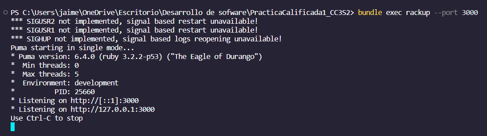

Como se menciono en el paso 2, al acceder a la ruta http://localhost:3000/ veremos el mensaje Hello World, como se muestra a continuación: 

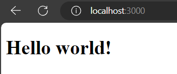

## Pregunta
 
**¿Qué sucede si intentas visitar una URL no raíz cómo https://localhost:3000/hello y por qué?**
<details><summary>Respuesta</summary>
<p><blockquote>
Si intentamos acceder a la ruta http://localhost:3000/hello, se generará un error, ya que dicha ruta no está definida en nuestra aplicación. Esto dará como resultado que muestre el siguiente mensaje de error:

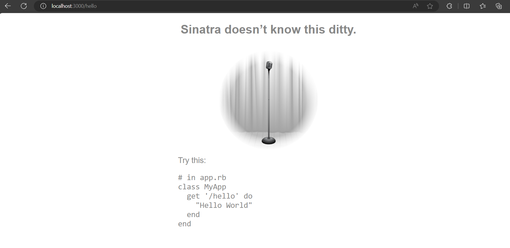

</p></blockquote></details>

## Modifica la aplicación
Para cambiar la salida de nuestra aplicación de "Hello world" a "Goodbye world", seguimos los siguientes pasos:
 
1. Detuvimos la aplicación actual mediante el comando `Ctrl-C`, como se muestra en la siguiente imagen:

    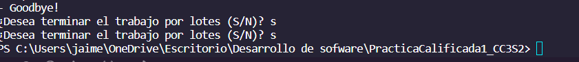


2. Luego, modificamos el archivo app.rb para que la aplicación muestre el mensaje "Goodbye world".
3. Después, reiniciamos la aplicación utilizando el comando bundle exec `rackup --port 3000` para el desarrollo local.

    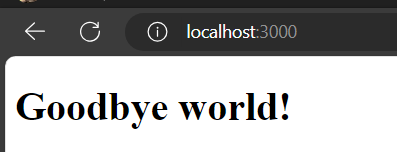


Esto ilustra que al realizar modificaciones en nuestra aplicación mientras esta se encuentra en ejecución, debemos reiniciar Rack para que los cambios surtan efecto. Para automatizar este proceso, podemos emplear la gema `rerun`, que reinicia automáticamente Rack cuando detecta cambios en los archivos del directorio de la aplicación.

Continuando, añadimos la gema `rerun` a nuestro archivo Gemfile, como se muestra en la siguiente imagen:

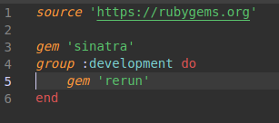

Con esto, ya no será necesario reiniciar manualmente el servidor cada vez que realicemos cambios en nuestra aplicación. La gema `rerun` se encargará de reiniciar automáticamente el servidor por nosotros.

**Instalación de la Gema "rerun" y Ejecución de la Aplicación con ella**

Para hacer uso de la gema `rerun` seguimos estos pasos:

1. Ejecutamos el comando bundle install para instalar la gema `rerun`.


2. Luego, ejecutamos la aplicación con la gema "rerun" utilizando el comando bundle exec rerun rackup --port 3000, como se ilustra en la imagen.


3. Con esto, el puerto estará configurado de la siguiente manera:  

    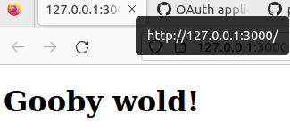

**Detección Automática de Cambios y Reinicio Automático del Servidor**

Ahora, si modificamos el mensaje HTML en nuestra aplicación a "Hello worl !" y guardamos los cambios, el servidor detectará automáticamente la modificación y se reiniciará por sí mismo, como se muestra aquí:

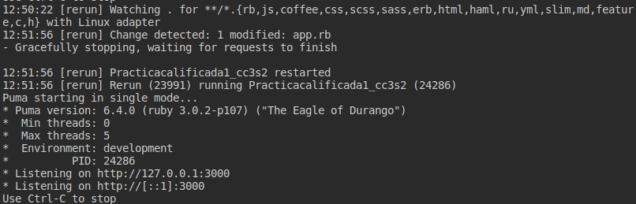

Si observamos el navegador, veremos que el mensaje también ha cambiado:

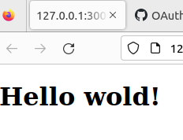

## Implementar en Heroku
Heroku es una plataforma como servicio (PaaS) en la nube que nos permite implementar nuestras aplicaciones Sinatra (y más adelante, Rails). Procedemos a crear una cuenta en http://www.heroku.com para poder llevar a cabo esta implementación.

**Paso 1: Instalamos Heroku CLI**  
**Paso 2: Iniciamos Sesión en nuestra Cuenta Heroku**
Ejecutamos el comando  `heroku login -i ` en nuestra terminal. Esto nos solicita ingresar el correo y la contraseña de nuestra cuenta de Heroku.

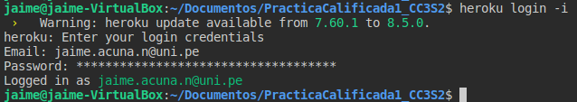

**Paso 3: Creamos una Nueva Aplicación Heroku**

Utilizamos el comando `heroku create` para crear una nueva aplicación en Heroku.

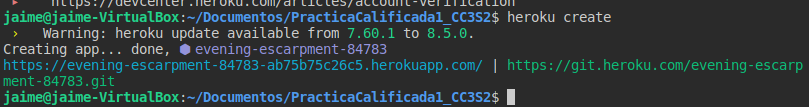

**Paso 4: Creamos un Archivo Procfile**

Creamos un archivo llamado "Procfile" en nuestro proyecto con las instrucciones necesarias para ejecutar nuestra aplicación en Heroku. Este archivo define el proceso web que Heroku debe ejecutar.

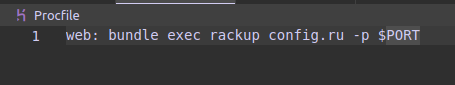

**Paso 5: Subimos nuestro Repositorio a Heroku**
Usamos el comando `git push heroku master` para cargar nuestro repositorio en Heroku.

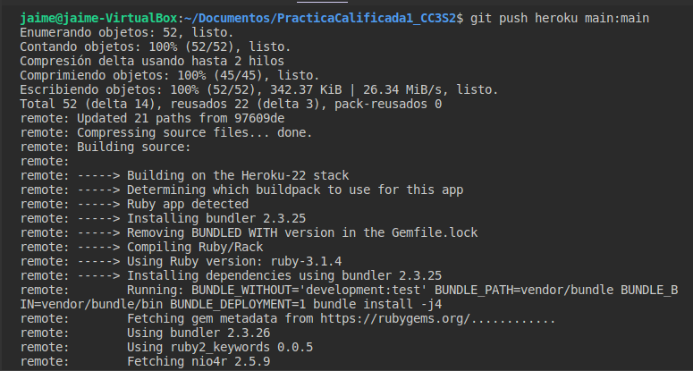

**Paso 6: Verificamos la Implementación en Heroku**

Podemos verificar la ejecución de nuestra aplicación desde la página de Heroku.


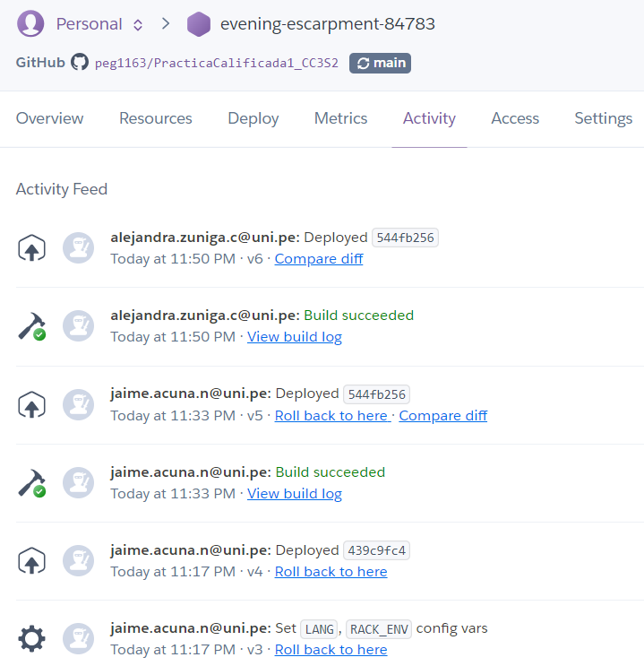

Si todo se ejecuta correctamente, vemos nuestra aplicación en funcionamiento en la plataforma Heroku.

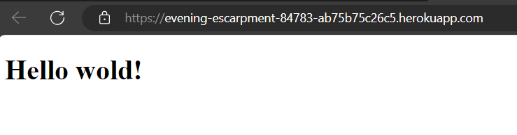
 
Este proceso nos permite llevar nuestra aplicación Sinatra a la nube y hacerla accesible en línea a través de Heroku.

# Parte 1: Wordguesser
Con todos estos pasos en mente, procedamos a clonar este repositorio y a trabajar en el juego de adivinanza de palabras, conocido como Wordguesser.

Para llevar a cabo esto, clonamos el repositorio de Wordguesser utilizando el siguiente comando:

    git clone https://github.com/saasbook/hw-sinatra-saas-wordguesser

Luego, ingresamos al repositorio clonado para continuar con nuestro trabajo.

    cd hw-sinatra-saas-wordguesser 

A continuación, se presenta una vista de lo que realizamos:

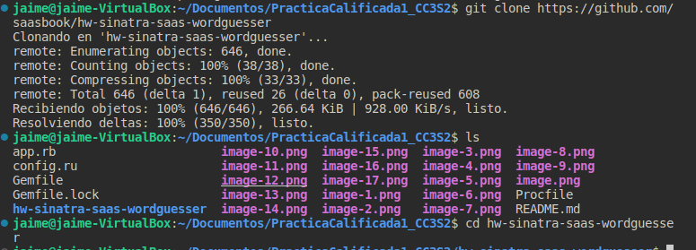
 


## Desarrollo de Wordguesser usando TDD y Guard

En esta etapa del desarrollo, nos centraremos en implementar la lógica del juego Wordguesser utilizando la metodología de Desarrollo Basado en Pruebas (TDD). 

 
A diferencia de lo que se muestra en la aplicación, optamos por utilizar Guard en lugar de Autotest para ejecutar las pruebas. Esta decisión se basó en ciertos problemas que enfrentamos con las gemas desactualizadas en el proyecto clonado, ya que este requería una versión específica de Ruby, que en este caso era Ruby 2.6.6. Para gestionar esta versión de Ruby, utilizamos RVM (Ruby Version Manager). Esto nos permitió asegurarnos de que estábamos trabajando con la versión exacta de Ruby que el proyecto requería- Sin embargo, dado que Autotest no funcionaba correctamente debido a las discrepancias en las gemas y las versiones de Ruby, decidimos optar por Guard para la ejecución de las pruebas. Guard nos proporcionó una solución más efectiva para administrar las pruebas y asegurarnos de que funcionaran sin problemas, incluso con nuestras gemas actualizadas y la versión específica de Ruby.
 

Una vez configurado nuestro entorno y ejecutado el guard, nos dimos cuenta de que había un conjunto de 18 pruebas pendientes:


Comenzaremos eliminando pending => true (estado pendiente) de la primera prueba y guardamos el archivo.Esto hará que Guard ejecute automaticamente las pruebas relacionadas.

 

Como momencionamos eliminamos  pending => true (estado "pendiente"), de este modo esta prueba dejará de estar pendiente, pero aún se observa que la prueba fallará, esto debio a que aún no hemos implementado el método al cual la prueba hace referencia.


## Pregunta
**Según los casos de prueba, ¿Cuántos argumentos espera el constructor de la clase de juegos (identifica la clase) y, por lo tanto, cómo será la primera línea de la definición del método que debes agregar a `wordguesser_game.rb`?**

```ruby
describe 'new' do
  it "takes a parameter and returns a WordGuesserGame object" do
    @game = WordGuesserGame.new('glorp')
    expect(@game).to be_an_instance_of(WordGuesserGame)
    expect(@game.word).to eq('glorp')
    expect(@game.guesses).to eq('')
    expect(@game.wrong_guesses).to eq('')
  end
end
```
 
<details><summary>Respuesta</summary>
<p><blockquote>

 El constructor de la clase WordGuesserGame espera un argumento, que es la palabra a adivinar. Entonces, la primera línea de la definición del método initialize en el archivo `wordguesser_game.rb` debería ser:
```  ruby
    def initialize(word_to_guess)
   ```
Esto significa que el constructor tomará un único argumento llamado *word_to_guess*, que será la palabra que se va a adivinar.  
</p></blockquote></details>

**Según las pruebas de este bloque describe, ¿Qué variables de instancia se espera que tenga WordGuesserGame?**

<details><summary>Respuesta</summary>
<p><blockquote>

Según las pruebas en el bloque `describe`, se espera que la clase `WordGuesserGame` tenga tres variables de instancia. La primera, `@game.word`, debería contener la palabra a adivinar. La segunda, `@game.guesses`, se llenará con las letras adivinadas correctamente y estará vacía al inicio. La tercera, `@game.wrong_guesses`, se utilizará para almacenar letras adivinadas incorrectamente y también comenzará vacía.
</p></blockquote></details>


Continuando con la actividad, implementamos la clase `WordGuesserGame` con un constructor que acepte los argumentos necesarios según las pruebas que tenemos. Además nos aseguramos de que estas variables actúen como getters y setters para que podamos acceder y modificar sus valores según sea necesario para pasar las pruebas.


Anteriormente, eliminamos *pending => true* de la primera prueba, como se puede observar, ya que planeamos trabajar en esta prueba una vez que hayamos implementado completamente la clase `WordGuesserGame`.


Cuando guardamos los cambios, el sistema de guardado detecta la modificación y nos muestra el siguiente mensaje:


Luego, continuamos eliminando *:pending => true* del resto de las pruebas: guess, check_win_or_lose y word_with_guesses.


Siguiendo las pruebas y los casos propuestos, a continuación, se presenta la prueba "guessing": 


Para esta prueba se implementa el método guess de la clase `WordGuesserGame`


Analogamente para el resto  pruebas check_win_or_lose y word_with_guesses


Se definio para prueba, su método respectivo.


Al guardar y actualizar las pruebas, hemos comprobado que cumplen con todos los requisitos necesarios:


Este proceso de desarrollo y pruebas asegura que nuestro código cumpla con los estándares y funcione correctamente.

# Parte 2: RESTful para Wordguesser

## Identificación del estado mínimo del juego

Antes de diseñar la aplicación, es importante identificar cuál es el estado mínimo del juego que debemos mantener para que los usuarios puedan jugar de manera efectiva. Este estado mínimo es esencial para preservar el progreso del juego entre las solicitudes HTTP.

**Pregunta 1: Enumera el estado mínimo del juego que se debe mantener durante una partida de Wordguesser.**

El estado mínimo del juego que debe mantenerse incluye:
- La palabra oculta que el jugador está tratando de adivinar.
- Las letras adivinadas correctamente.
- Las letras adivinadas incorrectamente.
- El número de intentos restantes.


## Identificación de las acciones del jugador

Para diseñar una aplicación interactiva como Wordguesser, es crucial identificar las acciones que los jugadores pueden realizar y que tienen un impacto en el estado del juego. Estas acciones definirán las rutas RESTful de la aplicación.

**Pregunta 2: Enumera las acciones del jugador que podrían provocar cambios en el estado del juego.**

 Las acciones del jugador que pueden cambiar el estado del juego incluyen:
- Adivinar una letra.
- Comenzar un nuevo juego.

## Asignación de métodos HTTP en un diseño RESTful

En el diseño de una aplicación RESTful, es fundamental asignar correctamente los métodos HTTP a las operaciones de recursos. Esto garantiza que las solicitudes se manejen de manera coherente y segura.

**Pregunta 3: Para un buen diseño RESTful, ¿cuáles de las operaciones de recursos deberían ser manejadas por HTTP GET y cuáles deberían ser manejadas por HTTP POST?**

En un diseño RESTful, las operaciones suelen manejarse de la siguiente manera:
- `GET` se utiliza para acciones que no modifican el estado del servidor y que pueden mostrarse en una página web, como mostrar el estado actual del juego o las páginas de victoria/derrota.
- `POST` se utiliza para acciones que modifican el estado del servidor, como enviar una adivinanza o iniciar un nuevo juego.

## Uso de `GET` en la acción "nueva"
En el diseño RESTful, es importante asignar el método HTTP correcto para cada acción. La pregunta se centra en la elección de `GET` para la acción "nueva" y su justificación.

**Pregunta 4: ¿Por qué es apropiado que la nueva acción utilice GET en lugar de POST?**

La acción "nueva" utiliza el método `GET` porque no modifica el estado del servidor. Simplemente muestra un formulario para que el usuario humano inicie un nuevo juego, y esta acción no tiene un impacto directo en el servidor.

## Acción `GET /new` en una arquitectura orientada a servicios

Se explora la necesidad de la acción `GET /new` en el contexto de una arquitectura orientada a servicios frente a una aplicación web tradicional.

**Pregunta 5: Explica por qué la acción GET /new no sería necesaria si tu juego Wordguesser fuera llamado como un servicio en una verdadera arquitectura orientada a servicios.**

En una arquitectura orientada a servicios, los servicios web generalmente no necesitan una acción `GET /new` porque las interacciones se realizan programáticamente a través de API y no a través de interfaces web humanas. La acción `GET /new` es específica de una interfaz web para permitir que los usuarios inicien juegos manualmente.

# Parte 3 :Conexión de WordGuesserGame a Sinatra
Con una comprensión más clara de los conceptos, vamos a conectar la aplicación con Sinatra.

## Pregunta 

**En este contexto, ¿de qué clase es la variable de instancia `@game`?**

 En el contexto proporcionado en la aplicación Sinatra, `@game` es una variable de instancia de la clase WordGuesserGame. Se utiliza para mantener el estado del juego a lo largo de las solicitudes HTTP.


## Pregunta

**¿Por qué esto ahorra trabajo en comparación con simplemente almacenar esos mensajes en el hash de sesion []?**

Usar flash[] ahorra trabajo porque elimina la necesidad de borrar manualmente los mensajes temporales de la sesión. Los mensajes flash se borran automáticamente después de su uso, lo que significa que los desarrolladores no tienen que preocuparse de mantener la sesión limpia.

### Ejecutando la aplicación Sinatra

Anteriormente, pudimos lanzar una aplicación sencilla con un "Hello World" en un puerto local. Ahora, vamos a levantar la aplicación Wordguesser en un puerto local con la ayuda de Sinatra. Ejecutamos el siguiente comando:

```
    bundle exec rerun -- rackup -port 3000
```

La siguiente imagen muestra el resultado de ejecutar el comando bundle exec rerun -- rackup -port 3000 en la terminal. Este comando levanta una aplicación Sinatra en el puerto 3000.


## Pregunta

**Según el resultado de ejecutar este comando, ¿cuál es la URL completa que debes visitar para visitar la página New Game?**

Al utilizar Sinatra, la aplicación se despliega en nuestro puerto local 3000. Para acceder a la página "New Game", simplemente debemos agregar "/new" a la URL del puerto local, lo que resulta en la siguiente dirección: http://localhost:3000/new, tal como se muestra en la imagen anterior.

Visitamos la URL proporcionada y confirmamos que la página "Iniciar New Game" se muestra correctamente:


**¿Dónde está el código HTML de esta página?**  
El código HTML de esta página se encuentra en el archivo new.erb. Cuando revisamos el código en app.rb, notamos que al ejecutar la ruta "/new", esta ruta renderiza el archivo "new.erb", que contiene el código HTML correspondiente.

Al hacer clic en el botón "New Game", se generará un error intencionado debido a que  al examinar el HTML en el archivo "new.erb", se puede notar que el elemento *form* está incompleto, lo que ocasiona el error al hacer clic en "New Game".


Este error es evidente cuando se intenta iniciar un nuevo juego, como se muestra en la siguiente imagen:


### Despliegue en Heroku :
# Desarrollate ale :v


# Parte 4 : Cucumber 

En nuestro proceso de desarrollo de software, utilizamos Cucumber para escribir pruebas de aceptación e integración de alto nivel en lenguaje natural, almacenadas en archivos .feature. Además, combinamos Cucumber con RSpec para impulsar el desarrollo de código. Para simular el comportamiento de un navegador y realizar pruebas de integración, utilizamos Capybara, que simula el servidor como lo haría un navegador y nos permite inspeccionar las respuestas de la aplicación a las acciones del usuario.

Una vez leida la sección sobre "Using Capybara with Cucumber”  en la página de inicio de Capybara, procedemos a responder las siguientes preguntas:

## Preguntas

**¿Qué pasos utiliza Capybara para simular el servidor como lo haría un navegador? ¿Qué pasos utiliza Capybara para inspeccionar la respuesta de la aplicación al estímulo?**

Para simular el servidor como lo haría un navegador utilizando Capybara en Cucumber, Capybara sigue estos pasos:

En primer lugar, se configura Capybara en el proyecto de Cucumber, como se muestra en el ejemplo proporcionado:
```ruby
require 'capybara/cucumber'
Capybara.app = MyRackApp
```

Luego, escribe los escenarios de prueba utilizando el DSL de Capybara en los pasos de Cucumber. Capybara interactuará con la aplicación web como lo haría un navegador. En el ejemplo proporcionado

```ruby
When /I sign in/ do
  within("#session") do
    fill_in 'Email', with: 'user@example.com'
    fill_in 'Password', with: 'password'
  end
  click_button 'Sign in'
end
```


**Mirando features/guess.feature, ¿cuál es la función de las tres líneas que siguen al encabezado "Feature:"?**
```
Feature: guess correct letter
  As a player playing Wordguesser
  So that I can make progress toward the goal
  I want to see when my guess is correct
```
Estas tres líneas que siguen al encabezado "Feature:" en un archivo de características de Cucumber funcionan como un comentario descriptivo o título de la característica. Este comentario brinda una breve descripción de alto nivel de lo que se está evaluando o probando en esa característica específica.

**En el mismo archivo, observando el paso del escenario Given I start a new game with word "garply" qué líneas en game_steps.rb se invocarán cuando Cucumber intente ejecutar este paso y cuál es el papel de la cadena "garply" en el paso?**

En el escenario "Given I start a new game with word "garply"", las líneas en `game_steps.rb` que se invocarán son las siguientes:

```ruby
When /^I start a new game with word "(.*)"$/ do |word|
  stub_request(:post, "http://randomword.saasbook.info/RandomWord").
    to_return(:status => 200, :headers => {}, :body => word)
  visit '/new'
  click_button "New Game"
end
```
El papel de la cadena "garply" en este paso es actuar como un argumento que se pasa al paso para personalizar la solicitud HTTP simulada y el inicio del juego.


### Haz que pase tu primer escenario

**Pregunta
Cuando el "simulador de navegador" en Capybara emite la solicitud de visit '/new', Capybara realizará
un HTTP GET a la URL parcial /new en la aplicación. ¿Por qué crees que visit siempre realiza un GET, en
lugar de dar la opción de realizar un GET o un POST en un paso determinado?**  
La razón por la que visit siempre hace una solicitud GET en Capybara es porque Capybara simula el comportamiento de un navegador web. Cuando los usuarios navegan por un sitio web, generalmente hacen clic en enlaces o escriben URL en la barra de direcciones, lo que resulta en solicitudes GET. Las solicitudes POST están más relacionadas con el envío de formularios, una acción más específica y deliberada. 

Para que se cumpla el primer escenario, debemos ejecutar el comando `cucumber features/start_new_game.feature`. Al hacerlo, notamos que la prueba no se aprueba debido a la necesidad de completar ciertos atributos en el formulario


Para resolver esto, agregamos un atributo adicional llamado "*action*". Este atributo especifica la acción que el usuario desea realizar.


Luego, ejecutamos el comando de prueba:

```
cucumber features/start_new_game.feature
```


Como se muestra a continuación, el cual nos da la siguiente salida que significa que nuestra prueba al impementar el atributo, paso.


## Pregunta 
¿Cuál es el significado de usar Given versus When versus Them en el archivo de características? ¿Qué pasa si los cambias? Realiza un experimento sencillo para averiguarlo y luego confirme los resultados utilizando Google.

Los pasos "Given", "When" y "Then" tienen significados específicos:

"Given" se utiliza para establecer el contexto inicial.  
"When" se utiliza para describir la acción que se realiza.  
"Then" se utiliza para describir las expectativas o resultados esperados después de la acción.

Cambiar estos pasos afectará el flujo de la prueba y cómo se comunica el comportamiento esperado de la aplicación. 

### Desarrollar el escenario para adivinar una letra

En esta etapa de desarrollo de nuestra aplicación, nos centraremos en el escenario en el que el usuario intenta adivinar una letra en un juego de ahorcado. Para llevar a cabo esta funcionalidad, utilizaremos el archivo `guess.feature.`


  

En la imagen podemos observar que las pruebas no pasaron debido a que aún no habíamos realizado modificaciones en la sección de "guess" en el archivo app.rb. Para solucionar esto, hemos realizado las siguientes modificaciones en el código:


Después de realizar estas modificaciones, procedimos a ejecutar nuevamente las pruebas:


Ahora, con las modificaciones realizadas en `app.rb`, observamos que las pruebas han tenido éxito y han pasado correctamente.


## Pregunta
En game_steps.rb, mira el código del paso "I start a new game..." y, en particular, el comando stub_request. Dada la pista de que ese comando lo proporciona una gema (biblioteca) llamada webmock, ¿qué sucede con esa línea y por qué es necesaria? (Utiliza Google si es necesario).
```ruby
When /^I start a new game with word "(.*)"$/ do |word|
  stub_request(:post, "http://randomword.saasbook.info/RandomWord").
    to_return(:status => 200, :headers => {}, :body => word)
  visit '/new'
  click_button "New Game"
end
```

La línea de código mencionada, utiliza la gema "webmock" para simular una solicitud HTTP POST a una URL que proporciona una palabra aleatoria. La simulación establece que la respuesta de la solicitud será la palabra que especificamos en el paso de prueba, en este caso **word**. Esto nos ayuda a hacer que nuestras pruebas sean más predecibles y controladas.

## Pregunta

**En tu código Sinatra para procesar una adivinación, ¿qué expresión usaría para extraer *solo el primer carácter* de lo que el usuario escribió en el campo de adivinación de letras del formulario en show.erb?**


# Parte 5: Otros casos 
Ahora , en el archivo feature vemos que hay mas pruebas que podemos ejecutar


y asi poder completar :


Veamos el caso de show , la prueba para este es ceheating.feature , ejecutamos el comando con cucumber y nos da lo siguiente : 


vemos que tambien depende de win y lose asi que completamos codigo para win ,lose y show  


Ejecutamos nuevamente las pruebas :


Para win o lose , esta game_over.feature , cuando ejecutamos el test en este hay algunos que logran pasar el test , esto sucede porque no depende solo de win o lose sino tambien de guess , aqui es donde pasan las pruebas .(la imagen es antes de completar win y lose )


Ejecutando las pruebas conm win y lose implementados :


