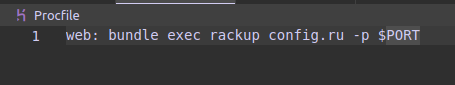

# Primera Práctica Calificada 
Integrantes:  
- Acuña
- Canales
- Zuñiga Alejandra

# Creacion de aplicaciones SaaS

**Objetivo:**  
El objetivo de este trabajo es comprender y documentar los pasos esenciales para crear, versionar e implementar una aplicación de Software como Servicio (SaaS). Además, se abordará la importancia de mantener la consistencia en los entornos de producción y desarrollo, asegurando que las bibliotecas y dependencias se gestionen adecuadamente.

**Tareas a Realizar:**  
En este proyecto, se llevarán a cabo las siguientes tareas:  
- Creación de una Aplicación "Hello World": Se desarrollará una aplicación de ejemplo utilizando el framework Sinatra.
- Versionamiento Correcto: Se aplicarán prácticas de versionamiento adecuadas para garantizar un control.efectivo del código fuente de la aplicación. Esto incluye el uso de sistemas de control de versiones como Git.

- Implementación en Heroku: La aplicación desarrollada se implementará en la plataforma de alojamiento en la nube Heroku. 


## Creación y versionado de una aplicación SaaS sencilla

Para llevar a cabo esto realizamos los siguientes pasos:

- Se creo un nuevo directorio vacío para contener la nueva aplicación y usamos git init en ese directorio para comenzar a versionarlo con Git.

- En ese directorio, se creo  un nuevo archivo llamado Gemfile con el siguiente contenido.  
 ```ruby
 source 'https://rubygems.org'
 ruby '2.6.6'  
 gem 'sinatra','>= 2.0.1'
 ```
             


<details><summary>Respuesta</summary>
<p><blockquote>
Crearemos un directorio llamado produccion y dentro de este directorio crearemos un archivo llamado Gemfile con el siguiente contenido:

```ruby

source 'https://rubygems.org'

ruby '2.6.6'

gem 'sinatra', '>= 2.0.1'
```	
Este archivo reconocera las versiones de las gemas (bibliotecas) que utilizaremos en nuestra aplicacion.
ahora para la instalacion ejecutaremos el comando `bundle install`

Al ejecutar este comando nos instala las gemas que necesitamos para nuestra aplicacion.


Para tener un sistema de versiones de nuestra aplicacion usaremos git , como ya tenemos el gemfile configurado ,controlaremos las 
versiones con git 


</p></blockquote>
</details>


## Preguntas 
¿Cuál es la diferencia entre el propósito y el contenido de Gemfile y Gemfile.lock? ¿Qué archivo se necesita para reproducir completamente las gemas del entorno de desarrollo en el entorno de producción?
Después de ejecutar el bundle, ¿por qué aparecen gemas en Gemfile.lock que no estaban en Gemfile?

<details><summary>Respuesta</summary>
<p><blockquote>
El archivo Gemfile que creamos es donde tendremos todas las gemas que necesitamos para la aplicacion ,mientras que Gemfile.lock guarda las versiones de estas y tambien las versiones de otras dependencias que necesitan las gemas que tenemos en Gemfile.
Por lo que asi tendriamos nuestros archivos :       


# Gemfile:


# Gemfile.lock:


Al ejecutar el comando , Bundle busca informacion de las gemas que se encuantran en el archivo Gemfile , por ejemplo sinatra , al instalar sinatra , bundle ve que esta dependencia requiere de otras por las que de manera recursiva instala todas las dependencias necesarias .

</p></blockquote>
</details>

## Crea una aplicación SaaS sencilla con Sinatra
Como se ha explicado las aplicaciones SaaS requieren un servidor web para recibir solicitudes HTTP del mundo exterior y un servidor de aplicaciones que "conecte" la lógica de su aplicación al servidor web. Para el desarrollo, usaremos webrick, un servidor web muy simple basado en Ruby que sería inapropiado para producción pero que está bien para el desarrollo. Tanto en desarrollo como en producción, utilizaremos el servidor de aplicaciones en rack basado en Ruby, que admite aplicaciones Ruby escritas en varios frameworks, incluidos Sinatra y Rails.
Como se ha explicado una aplicación SaaS esencialmente reconoce y responde a las solicitudes HTTP correspondientes a las rutas de la aplicación (recuerda que una ruta consta de un método HTTP como GET o POST más un URI). Sinatra proporciona una abreviatura ligera para coincidir una ruta con el código de aplicación que se ejecutará cuando llegue una solicitud de uso de esa ruta desde el servidor web.
Crea un archivo en tu proyecto llamado app.rb que contenga lo siguiente:
```ruby	
require 'sinatra' 
    class MyApp < Sinatra::Base 
        get '/' do 
            "<!DOCTYPE html><html><head></head><body><h1>Hello World</h1></body></html>" 
    end 
end
```
El método get lo proporciona la clase Sinatra::Base, de la cual hereda la clase MyApp. Sinatra::Base está disponible porque cargamos la biblioteca Sinatra en la línea 1.
Como puedes ver en el ejemplo simple anterior, Sinatra te permite escribir funciones que coinciden con una ruta HTTP entrante, en este caso GET '/' (la URL raíz), se devolverá a la presentación un documento HTML muy simple que contiene la cadena Hello world como resultado de la solicitud.
Para ejecutar la aplicación, tenemos que iniciar el servidor de aplicaciones y el servidor de nivel de presentación (web). El servidor de aplicaciones en rack está controlado por un archivo config.ru, que ahora debe crear y agregar al control de versiones, y que contiene lo siguiente:
```ruby
require './app' 
run MyApp
```
La primera línea le dice a Rack que la aplicación se encuentra en el archivo app.rb, que creó anteriormente para contener el código de tu aplicación. Tenemos que indicar explícitamente que el archivo de la aplicación está ubicado en el directorio actual (.) porque normalmente require busca solo en directorios estándar del sistema para encontrar gemas.
Ahora estás listo para probar la sencilla aplicación con una línea de comando:

    bundle exec rackup --port 3000

<details><summary>Respuesta</summary>
<p><blockquote>
Ejecutando el comando `bundle exec rackup --port 3000` nos muestra que nuestra aplicacion esta corriendo en el puerto 3000 :


si ingresamos a la ruta http://localhost:3000/ nos mostrara el mensaje Hello World: 


</p></blockquote></details>


## Pregunta
¿Qué sucede si intentas visitar una URL no raíz cómo https://localhost:3000/hello y por qué? (la raíz de tu URL variará)
<details><summary>Respuesta</summary>
<p><blockquote>
Al acceder a la ruta http://localhost:3000/hello nos mostrara un error ya que no existe esa ruta en nuestra aplicacion , por lo que nos mostrara el siguiente mensaje:


</p></blockquote></details>

## Modifica la aplicación
Modifica app.rb para que en lugar de "Hello world" imprime "Goodbye world". Guarda tus cambios en app.rb e intenta actualizar la pestaña de tu navegador donde se ejecuta la aplicación.
Ahora regresa a la ventana del shell donde ejecutaste rackup y presione Ctrl-C para detener Rack. Luego escribe bundle exec rackup --port 3000 para desarrollo local y una vez que se esté ejecutando, regresa a la pestaña de tu navegador con tu aplicación y actualiza la página. Esta vez debería funcionar.

<details><summary>Respuesta</summary>
<p><blockquote>
Primero cancelamos la ejecucion de la aplicacion con el comando `Ctrl-C`  :


modificamos el archivo app.rb para que nos muestre el mensaje Goodbye world y ejectuamos el comando `bundle exec rackup --port 3000` para volver a ejecutar la aplicacion :


</p></blockquote></details>

Lo que esto te muestra es que, si modificas tu aplicación mientras se está ejecutando, debes reiniciar Rack para que "veas" esos cambios. Dado que reiniciarlo manualmente es tedioso, usaremos la gema de rerun, que reinicia Rack automáticamente cuando ve cambios en los archivos en el directorio de la aplicación. (Rails hace esto de forma predeterminada durante el desarrollo, como veremos, pero Sinatra no).
Probablemente ya estés pensando:  Si la aplicación depende de esta gema adicional, debemos agregarla al Gemfile y ejecutar el paquete para asegurarnos de que esté realmente presente”. Buen pensamiento. Pero también se te puede ocurrir que esta gema en particular no sería necesaria en un entorno de producción: sólo la necesitamos como herramienta durante el desarrollo. Afortunadamente, hay una manera de decirle a Bundler que algunas gemas sólo son necesarias en determinados entornos. Agrega lo siguiente al Gemfile (no importa dónde):
<details><summary>Respuesta</summary>
<p><blockquote>
Agregamos la gema rerun al archivo Gemfile :


al tener esto , no sera necesario reiniciar el servidor cada vez que hagamos un cambio en nuestra aplicacion , ya que esta gema se encargara de reiniciar el servidor automaticamente.
Ejecutamos el comando `bundle install` para instalar la gema rerun para luego ejecutar el comando `bundle exec rerun rackup --port 3000` para ejecutar la aplicacion con la gema rerun :


El puerto estaria de esta forma : 


Ahora si cambiamos el mensaje del html a Hello worl ! y guardamos , el servidor detectara el cambio y reiniciara automaticamente :


y si vemos en el navegador el mensaje cambio :


</p></blockquote></details>

## Implementar en Heroku
Heroku es una plataforma como servicio (PaaS) en la nube donde podemos implementar las aplicaciones Sinatra (y posteriores Rails). Si aún no tiene una cuenta, regístrese en http://www.heroku.com. Necesitarás su nombre de usuario y contraseña para el siguiente paso.
Instala Heroku CLI siguiendo las instrucciones. 
Inicia sesión en tu cuenta Heroku escribiendo el comando: heroku login -i en la terminal. Esto te conectará con tu cuenta Heroku.

<details><summary>Respuesta</summary>
<p><blockquote>

ejecutamos el comando y nos pedira el correo y la contraseña de nuestra cuenta de heroku : 


heroku create :


Procfile:

</p></blockquote></details>

{
    "workbench.colorTheme": "SynthWave '84",
    "notebook.lineNumbers": "on",
    "notebook.consolidatedRunButton": true,
    "jupyter.askForKernelRestart": false,
    "github.copilot.enable": {
        "*": true,
        "plaintext": false,
        "markdown": true,
        "scminput": false
    },
    "workbench.iconTheme": "material-icon-theme",
    "explorer.confirmDragAndDrop": false,
    "liveshare.allowGuestTaskControl": true,
    "liveshare.alwaysFollowHost": true
}


