# Primera Práctica Calificada 
Integrantes:  
- Acuña Napan Jaime Gonzalo
- Canales Yarin, Edward Alexander
- Zuñiga Chicaña, Alejandra Aztirma  

# Creacion de aplicaciones SaaS

**Objetivo:**  
El objetivo de este trabajo es comprender y documentar los pasos esenciales para crear, versionar e implementar una aplicación de Software como Servicio (SaaS). Además, se abordará la importancia de mantener la consistencia en los entornos de producción y desarrollo, asegurando que las bibliotecas y dependencias se gestionen adecuadamente.

**Tareas a Realizar:**  
En este proyecto, se llevarán a cabo las siguientes tareas:  
- Creación de una Aplicación "Hello World": Se desarrollará una aplicación de ejemplo utilizando el framework Sinatra.
- Versionamiento Correcto: Se aplicarán prácticas de versionamiento adecuadas para garantizar un control.efectivo del código fuente de la aplicación. Esto incluye el uso de sistemas de control de versiones como Git.

- Implementación en Heroku: La aplicación desarrollada se implementará en la plataforma de alojamiento en la nube Heroku. 


## Creación y versionado de una aplicación SaaS sencilla

Para llevar a cabo esto realizamos los siguientes pasos:

- Creamos un nuevo directorio vacío destinado a alojar nuestra nueva aplicación y utilizamos el comando git init en ese directorio para iniciar el control de versiones mediante Git.

- Dentro de este directorio, creamos un archivo nuevo llamado Gemfile con el siguiente contenido: 

 ```ruby
 source 'https://rubygems.org'
 ruby '2.6.6'  
 gem 'sinatra','>= 2.0.1'
 ```
             
Este archivo reconocera las versiones de las gemas (bibliotecas) que utilizaremos en nuestra aplicacion.

Luego, procedemos a la instalación de estas gemas ejecutando el comando `bundle install`. Esta acción instala automáticamente las gemas necesarias para el funcionamiento de nuestra aplicación.

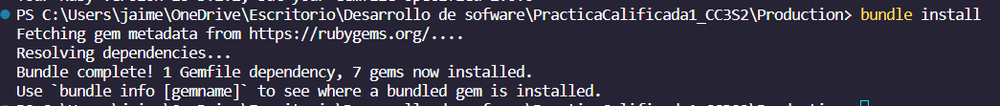

Para mantener un sistema de control de versiones para nuestra aplicación, utilizamos Git. Gracias a la configuración previa del Gemfile, podemos controlar las versiones de manera efectiva a través de Git.

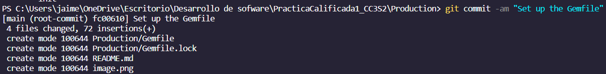

 

### Preguntas 
<details><summary>Respuestas</summary>
<p><blockquote>

**¿Cuál es la diferencia entre el propósito y el contenido de Gemfile y Gemfile.lock?**


El archivo *Gemfile* que creamos alberga una lista de todas las gemas necesarias para nuestra aplicación.

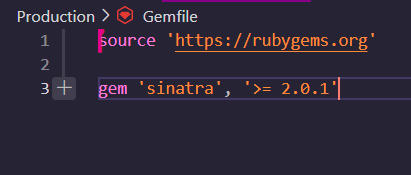

Por otro lado, *Gemfile.lock* registra no solo las versiones de estas gemas, sino también las versiones de otras dependencias requeridas por las gemas especificadas en Gemfile.

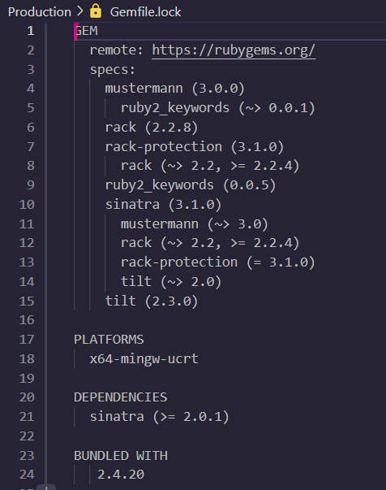

**¿Qué archivo se necesita para reproducir completamente las gemas del entorno de desarrollo en el entorno de producción?**

Para reproducir completamente las gemas del entorno de desarrollo en el entorno de producción, se necesita el archivo *Gemfile.lock*. Este archivo proporciona información detallada sobre las versiones exactas de las gemas y sus dependencias que deben instalarse para que la aplicación funcione correctamente en producción.


**Después de ejecutar el bundle, ¿Por qué aparecen gemas en Gemfile.lock que no estaban en Gemfile?**

Al ejecutar el comando "bundle", Bundler examina las gemas especificadas en el archivo Gemfile. Por ejemplo, cuando se instala Sinatra, Bundler detecta que esta dependencia tiene requisitos adicionales, por lo que de manera recursiva instala todas las dependencias necesarias para satisfacer estos requisitos.
    
</p></blockquote></details>

## Crea una aplicación SaaS sencilla con Sinatra

En el desarrollo de aplicaciones SaaS, comenzaremos con Webrick para pruebas y luego usaremos Rack en producción. Sinatra, un marco ligero, nos permitirá definir cómo nuestra aplicación manejará solicitudes HTTP.

**Paso 1: Creación del Archivo de la Aplicación**

En un archivo llamado app.rb, escribimos el siguiente código:

```ruby	
require 'sinatra' 
    class MyApp < Sinatra::Base 
        get '/' do 
            "<!DOCTYPE html><html><head></head><body><h1>Hello World</h1></body></html>" 
    end 
end
```
Este código responde con "Hello World" cuando accedemos a la URL proporcionada.

**Paso 2: Configuración del Archivo config.ru**

Creamos un archivo llamado config.ru con el siguiente contenido:


```ruby
require './app' 
run MyApp
```
Esto le dice a Rack que nuestra aplicación se encuentra en app.rb.

**Paso 3: Ejecución de la Aplicación**

Finalmente, ejecutamos la aplicación con el siguiente comando:

    bundle exec rackup --port 3000

Después de haber completado los pasos anteriores, podremos verificar que nuestra aplicación está en funcionamiento en el puerto 3000, como se muestra en la siguiente imagen: 

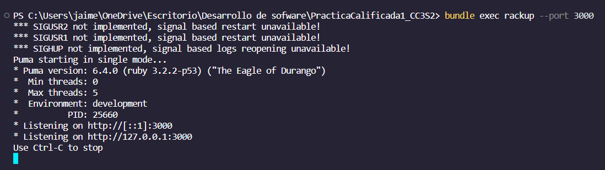

Como se menciono en el paso 2, al acceder a la ruta http://localhost:3000/ veremos el mensaje Hello World, como se muestra a continuación: 

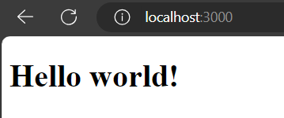

## Pregunta
 
**¿Qué sucede si intentas visitar una URL no raíz cómo https://localhost:3000/hello y por qué?**
<details><summary>Respuesta</summary>
<p><blockquote>
Si intentamos acceder a la ruta http://localhost:3000/hello, se generará un error, ya que dicha ruta no está definida en nuestra aplicación. Esto dará como resultado que muestre el siguiente mensaje de error:

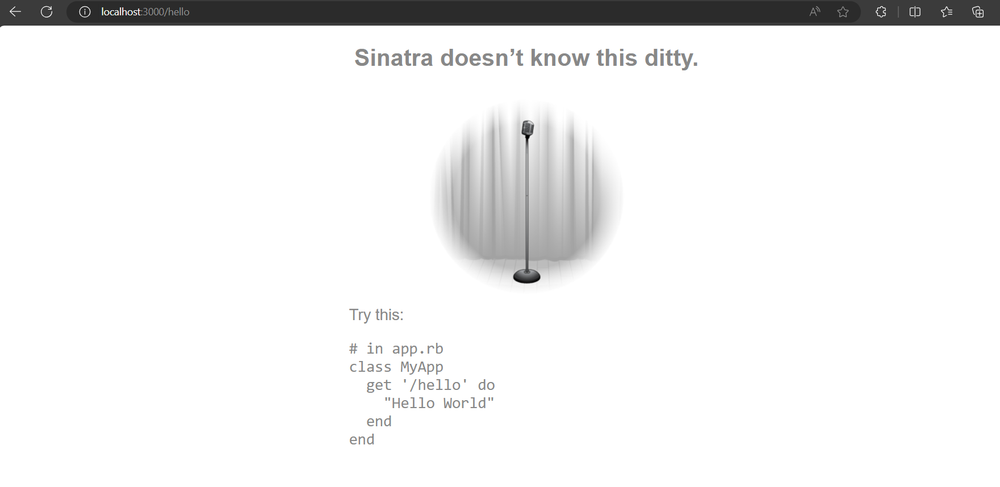

</p></blockquote></details>

## Modifica la aplicación
Para cambiar la salida de nuestra aplicación de "Hello world" a "Goodbye world", seguimos los siguientes pasos:
 
1. Detuvimos la aplicación actual mediante el comando `Ctrl-C`, como se muestra en la siguiente imagen:

    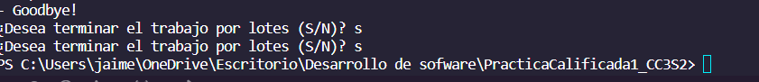


2. Luego, modificamos el archivo app.rb para que la aplicación muestre el mensaje "Goodbye world".
3. Después, reiniciamos la aplicación utilizando el comando bundle exec `rackup --port 3000` para el desarrollo local.

    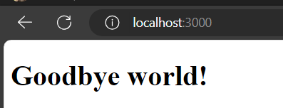


Esto ilustra que al realizar modificaciones en nuestra aplicación mientras esta se encuentra en ejecución, debemos reiniciar Rack para que los cambios surtan efecto. Para automatizar este proceso, podemos emplear la gema `rerun`, que reinicia automáticamente Rack cuando detecta cambios en los archivos del directorio de la aplicación.

Continuando, añadimos la gema `rerun` a nuestro archivo Gemfile, como se muestra en la siguiente imagen:

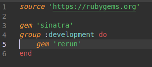

Con esto, ya no será necesario reiniciar manualmente el servidor cada vez que realicemos cambios en nuestra aplicación. La gema `rerun` se encargará de reiniciar automáticamente el servidor por nosotros.

**Instalación de la Gema "rerun" y Ejecución de la Aplicación con ella**

Para hacer uso de la gema `rerun` seguimos estos pasos:

1. Ejecutamos el comando bundle install para instalar la gema `rerun`.


2. Luego, ejecutamos la aplicación con la gema "rerun" utilizando el comando bundle exec rerun rackup --port 3000, como se ilustra en la imagen.
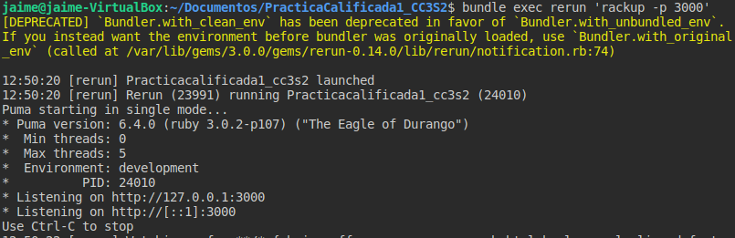

3. Con esto, el puerto estará configurado de la siguiente manera:  

    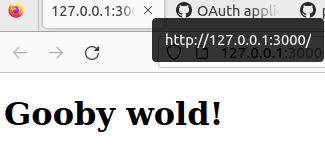

**Detección Automática de Cambios y Reinicio Automático del Servidor**

Ahora, si modificamos el mensaje HTML en nuestra aplicación a "Hello worl !" y guardamos los cambios, el servidor detectará automáticamente la modificación y se reiniciará por sí mismo, como se muestra aquí:

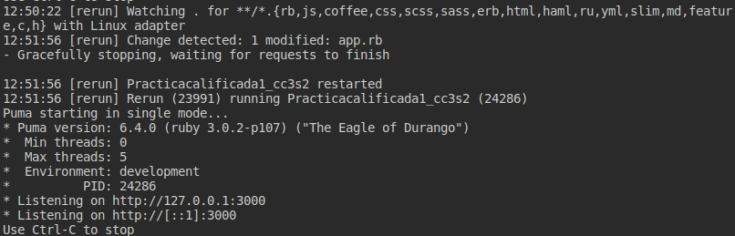

Si observamos el navegador, veremos que el mensaje también ha cambiado:

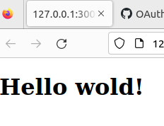

## Implementar en Heroku
Heroku es una plataforma como servicio (PaaS) en la nube que nos permite implementar nuestras aplicaciones Sinatra (y más adelante, Rails). Procedemos a crear una cuenta en http://www.heroku.com para poder llevar a cabo esta implementación.

**Paso 1: Instalamos Heroku CLI**  
**Paso 2: Iniciamos Sesión en nuestra Cuenta Heroku**
Ejecutamos el comando  `heroku login -i ` en nuestra terminal. Esto nos solicita ingresar el correo y la contraseña de nuestra cuenta de Heroku.

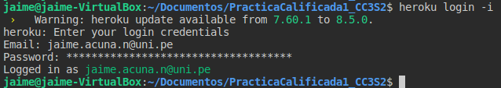

**Paso 3: Creamos una Nueva Aplicación Heroku**

Utilizamos el comando `heroku create` para crear una nueva aplicación en Heroku.

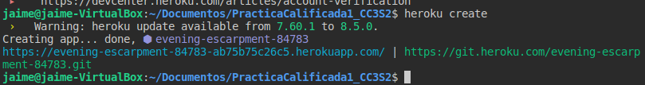

**Paso 4: Creamos un Archivo Procfile**

Creamos un archivo llamado "Procfile" en nuestro proyecto con las instrucciones necesarias para ejecutar nuestra aplicación en Heroku. Este archivo define el proceso web que Heroku debe ejecutar.

**Paso 5: Subimos nuestro Repositorio a Heroku**
Usamos el comando `git push heroku master` para cargar nuestro repositorio en Heroku.

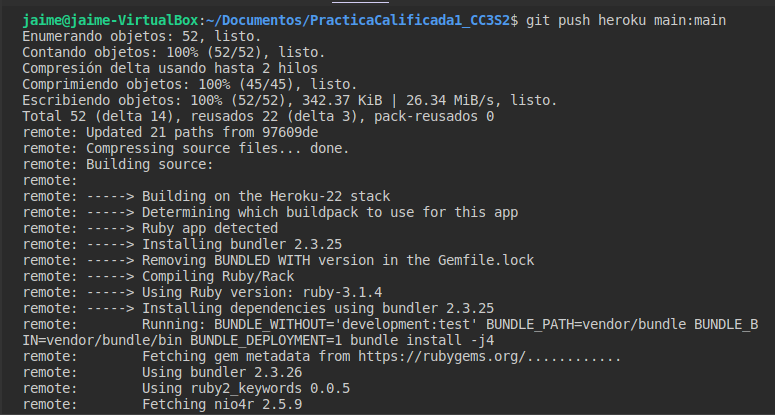

**Paso 6: Verificamos la Implementación en Heroku**

Podemos verificar la ejecución de nuestra aplicación desde la página de Heroku.


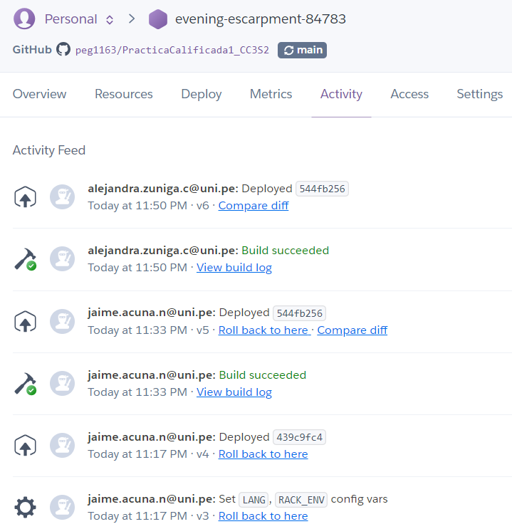

Si todo se ejecuta correctamente, vemos nuestra aplicación en funcionamiento en la plataforma Heroku.

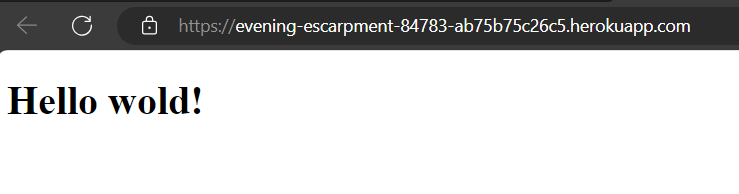
 
Este proceso nos permite llevar nuestra aplicación Sinatra a la nube y hacerla accesible en línea a través de Heroku.

# Parte 1: Wordguesser
Con todos estos pasos en mente, procedamos a clonar este repositorio y a trabajar en el juego de adivinanza de palabras, conocido como Wordguesser.

Para llevar a cabo esto, clonamos el repositorio de Wordguesser utilizando el siguiente comando:

    git clone https://github.com/saasbook/hw-sinatra-saas-wordguesser

Luego, ingresamos al repositorio clonado para continuar con nuestro trabajo.

    cd hw-sinatra-saas-wordguesser 

A continuación, se presenta una vista de lo que realizamos:


 


## Desarrollo de Wordguesser usando TDD y Guard
En esta actividad utilizaremos el desarrollo basado en pruebas (TDD) basado en las pruebas que proporcionamos para desarrollar la lógica del juego para Wordguesser, lo que te obliga a pensar en qué datos son necesarios para capturar el estado del juego. Esto será importante cuando hagas el juego en forma SaaS en la siguiente parte.
Qué harás: utilizarás  autotest: los casos de prueba proporcionados se volverán a ejecutar cada vez que realices un cambio en el código de la aplicación. Una por una, las pruebas pasarán de rojo (reprobado) a verde (aprobado) a medida que creas el código de la aplicación. Cuando hayas terminado, tendrá una clase de juego Wordguesser funcional, lista para ser "envuelta" en SaaS usando Sinatra.
El juego de adivinanzas de palabras basado en la Web funcionará de la siguiente manera:
-	La computadora elige una palabra al azar.
-	El jugador adivina letras para adivinar la palabra.
-	Si el jugador adivina la palabra antes de adivinar siete letras incorrectamente, gana, de lo contrario pierden. (Adivinar la misma letra repetidamente simplemente se ignora).
-	Una letra que ya ha sido adivinada o que no es un carácter del alfabeto se considera "no válida", es decir, no es una adivinación "válida".
Para que el juego sea divertido, cada vez que inicies un nuevo juego, la aplicación recuperará 	una palabra en inglés aleatoria de un servidor remoto, por lo que cada juego será diferente. Esta 	característica te presentará no sólo el uso de un servicio externo (el generador de palabras 	aleatorias) como un "bloque de construcción" en una arquitectura orientada a servicios, sino 	también cómo un escenario de Cucumber puedes probar dicha aplicación de manera 		determinista con pruebas que rompan la dependencia del servicio externo en el momento de 	la prueba.
-	En el directorio raíz de la aplicación, escribe bundle exec autotest.
Esto activará el framework Autotest, que busca varios archivos para determinar qué tipo de aplicación estás probando y qué framework de prueba estás usando. En este caso, descubrirá el archivo llamado .rspec, que contiene opciones de RSpec e indica que estamos usando el framework de prueba de RSpec. Por lo tanto, Autotest buscará archivos de prueba en spec/ y los archivos de clase correspondientes en lib/.
Proporcionamos un conjunto de 18 casos de prueba para ayudarte a desarrollar la clase de juego. Echa un vistazo a spec/wordguesser_game_spec.rb. Especifica los comportamientos que espera de la clase lib/wordguesser_game.rb. Inicialmente, agregamos :pending => true a cada especificación (spec), por lo que cuando Autotest las ejecute por primera vez, debería ver los nombres de los casos de prueba impresos en amarillo y el informe "18 examples, 0 failures, 18 pending".
Ahora, con Autotest aun ejecutándose, elimina :pending => true y guarde el archivo. Deberías ver inmediatamente que Autotest se activa y vuelve a ejecutar las pruebas. Ahora debería tener 18 ejemplos, 1 fallido y 17 pendientes.
El bloque describe ‘new’ significa "el siguiente bloque de pruebas describe el comportamiento de una 'nueva' instancia de WordGuesserGame". La línea WordGuesserGame.new hace que se cree una nueva instancia y las siguientes líneas verifican la presencia y los valores de las variables de instancia.


